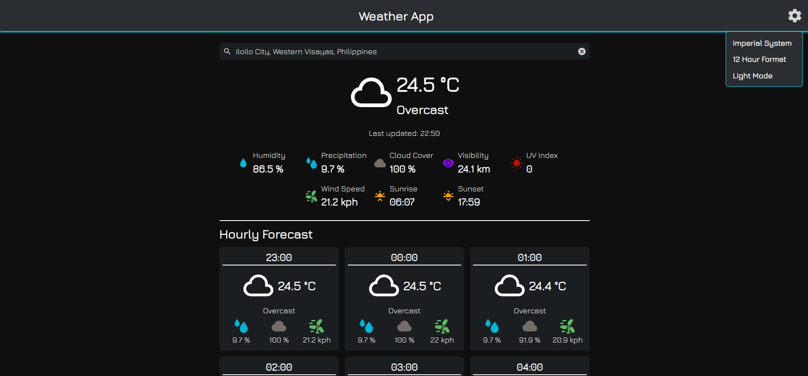
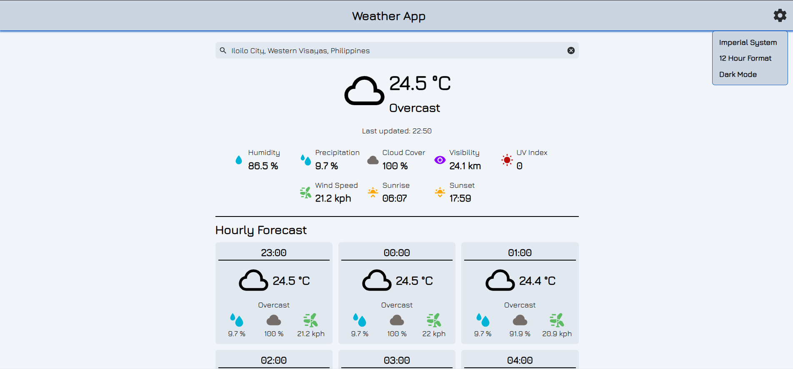

# weather-app
__weather-app__ is a personal project developed as part of the [__JavaScript__](https://www.theodinproject.com/lessons/node-path-javascript-weather-app) course from [__The Odin Project__](https://www.theodinproject.com).

### This personal project was undertaken to learn and practice the following:
* API Keys
* Asynchronous Code
* Editing SVG Source Code

## Preview

  
  
  <a href="https://lanezedfer.github.io/weather-app/">Link to Live Preview</a>

## Requirements
* Node.js
* npm (Installed as part of Node.js)
* Visual Crossing API key (Create Visual Crossing Account)

## Getting Started
1. Run the following command to clone the project into your specified directory:

`git clone https://github.com/Lanezedfer/weather-app.git`

2. Navigate to the project's directory then run the following command to install the dependencies:

`npm install`

3. Navigate to `src/code/javascript/weather-api.js` then copy-paste your Visual Crossing API key as the value to `const API_KEY`.

4. Run the following command to start the development server:

`npm run dev`

5. Run the following command to build the project for production:

`npm run prod`

# Acknowledgements
### API:
* [__Visual Crossing__](https://www.visualcrossing.com/about)

### Course:
* [__The Odin Project__](https://www.theodinproject.com/about)

### Font Used:
* [__Jura__](https://fonts.google.com/specimen/Jura/about)

### Icons Used:
* [__Pictogrammers__](https://pictogrammers.com)
* [__Google Material Symbols and Icons__](https://fonts.google.com/icons)

# License
This project is distributed under the MIT License. View [`LICENSE.txt`](LICENSE.txt) for more information.

# Author
* Lance Ezeckel P. Fernando (fernando.lance.eze@gmail.com)
